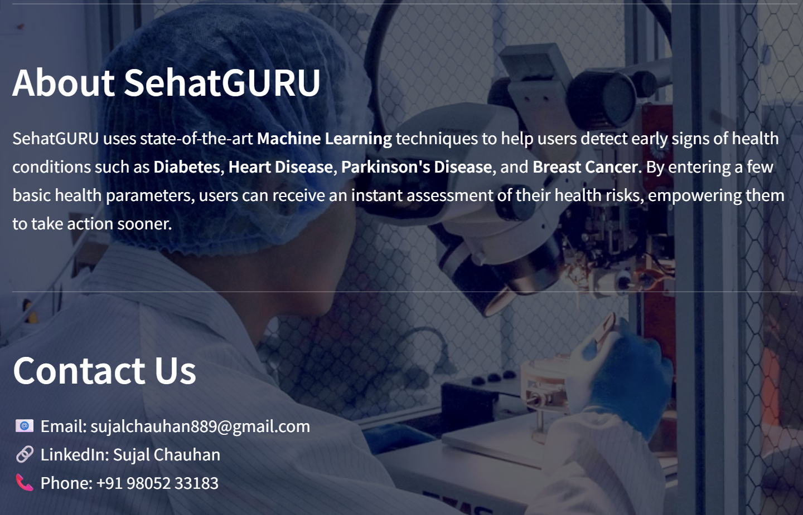
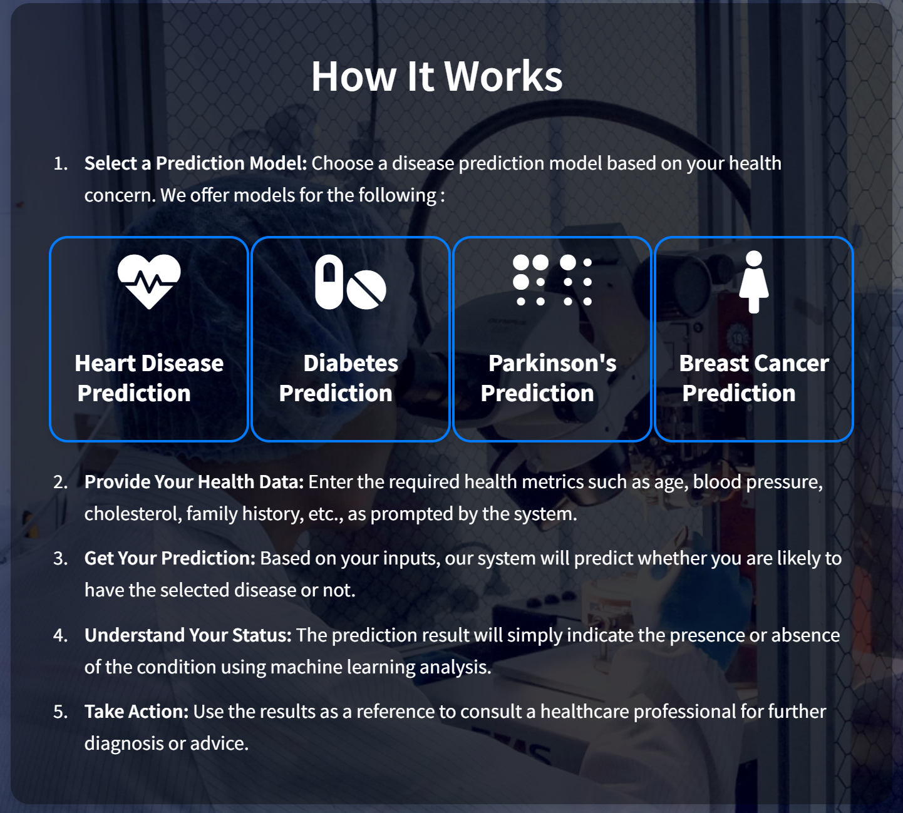
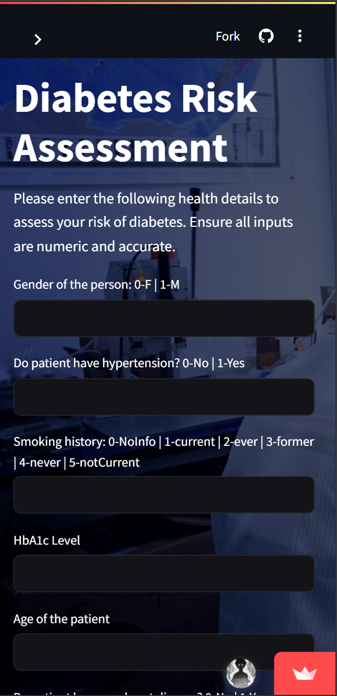
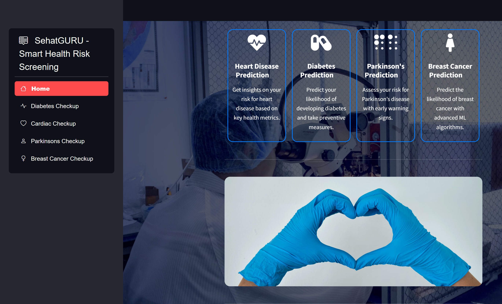

<p align="center">
  
</p>

# 🩺 SehatGURU – Multiple Disease Prediction App  
_Early-stage disease detection powered by Machine Learning & Streamlit._


---

<p align="center">
  
</p>

---

## 🚀 Features  

- 🧬 **Multiple Disease Prediction** – Supports **Diabetes, Parkinson’s Disease, Cardiovascular Disease, and Breast Cancer**.  
- 🤖 **Optimized ML Models** – Random Forest outperformed SVM & Logistic Regression.  
- 🌐 **Web App with Streamlit** – User-friendly interface for real-world usability.  
- ⚖️ **Feature Engineering** – Feature Scaling & **SMOTE** for handling imbalanced datasets.  
- 🎯 **High Accuracy** – Achieved up to **97% prediction accuracy**.  

---

## 🛠 Tech Stack  

- **Language**: Python  
- **Framework**: Streamlit  
- **Libraries**: Scikit-learn, Pandas, NumPy, Imbalanced-learn  
- **Modeling**: Random Forest, Logistic Regression, SVM  
- **Tools**: Jupyter Notebook, GitHub  

---

## 📦 Prerequisites  

- Python `3.8+`  
- pip or conda  

---

## 🚀 Getting Started  

```bash
# 1️⃣ Clone the repository
git clone https://github.com/sujal-chauhan/SehatGURU.git
cd SehatGURU

# 2️⃣ Install dependencies
pip install -r requirements.txt

# 3️⃣ Run the Streamlit app
streamlit run "multiple disease pred.py"

# 👉 Open in your browser
http://localhost:8501

```

---
## 📂 Project Structure

```text
SehatGURU/
├── MDP-logo.png                     # Project logo
├── doctor.jpg                       # Preview image
├── multiple disease pred.py         # Main Streamlit app
├── requirements.txt                 # Dependencies
├── trained_breast_cancer_model.sav  # Breast Cancer ML model
├── trained_diabetes.sav             # Diabetes ML model
├── trained_heart.sav                # Cardiovascular ML model
├── trained_parkinson.sav            # Parkinson’s ML model
└── README.md                        # Project documentation
```

---
## 📊 Model Performance

- **Random Forest** → Best performing (97% accuracy)  
- **Logistic Regression** → Baseline model  
- **SVM** → Moderate accuracy  

📈 **Metrics used:** Accuracy, Precision, Recall, F1-Score  

---

## 📸 Screenshots

🏠 App Homepage  
<p align="center">  </p>

ℹ️ About SehatGURU
<p align="center">  </p>

⚙️ How It Works
<p align="center">  </p>

📱 Mobile View
<p align="center">  </p>

🧭 Sidebar Navigation
<p align="center">  </p>

---

## 🙏 Acknowledgments

- **Streamlit** for web deployment  
- **Scikit-learn** for ML models  
- **Imbalanced-learn** for SMOTE  
- **Pandas** & **NumPy** for data handling  

⚡ Predict smarter. Stay healthier. – SehatGURU by Sujal Chauhan
---
